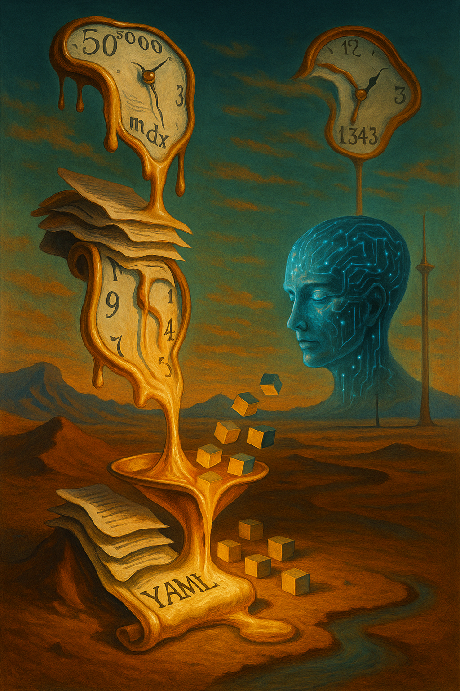

# SurrealAIDoc

A documentation extraction and compression system that converts SurrealDB's documentation into AI-optimized schemas. Achieves 85% coverage of SurrealQL syntax in a fraction of the original size.

**TLDR**: The YAML outputs for SurrealQL syntax are in the [output folder](https://github.com/Corlzee/Dali-Distiller/tree/master/output).

<div align="center">
  
  
  *"This is not entirely Dalí... but it distills perfectly."*
</div>

## Overview

This project extracts syntax patterns, function signatures, and operators from SurrealDB documentation and compresses them into schemas suitable for AI language models. The original documentation spans 297,445 tokens; this system provides the essential information in as little as 2,185 tokens.

## Features

- Extracts 42 statement syntaxes
- Captures 253 function signatures across 20 namespaces
- Documents 36 operators in 8 categories
- Provides multiple output formats for different use cases
- Generates monolithic files for easy integration

## Installation

```bash
git clone https://github.com/yourusername/surrealAIdoc.git
cd surrealAIdoc
pip install tiktoken pyyaml
```

## Usage

### Basic Extraction

First, extract syntax from the SurrealDB documentation:

```bash
python3 src/extractor_v2.py --docs-path /path/to/docs.surrealdb.com
```

### Schema Generation

Generate schemas in different formats:

```bash
# Generate both full and compressed schemas
python3 src/converter_final.py --format both

# Generate only the full schema (12k tokens)
python3 src/converter_final.py --format full

# Generate only the compressed schema (2k tokens)
python3 src/converter_final.py --format compressed
```

## Output Formats

### Full Schema (12,698 tokens)
- Complete keyword lists for each statement
- Full function signatures with parameter types
- Operator descriptions and alternatives
- Best for: GPT-4, Claude, and other large context models

### Compressed Schema (2,185 tokens)
- Abbreviated statement keywords
- Type-compressed function signatures (e.g., `av>a` for `array, value -> array`)
- Minimal operator representations
- Best for: Smaller models or token-constrained environments

### Monolith Files
Self-contained markdown files for direct integration:
- `SURREALQL_MONOLITH_FULL.md` - Full schema only
- `SURREALQL_MONOLITH_COMPRESSED.md` - Compressed schema only
- `SURREALQL_MONOLITH_BOTH.md` - Both schemas in one file

## Schema Structure

### Statements
```yaml
statements:
  select:
    keywords: [SELECT, FROM, WHERE, ORDER, LIMIT]
    variables: [field, table, condition]
    syntax_pattern: "SELECT <var> FROM <var> WHERE <var>"
```

### Functions
```yaml
functions:
  array:
    add:
      signatures:
        - pattern: "array::add(array, value) -> array"
          params: [array, value]
          returns: array
```

### Operators
```yaml
operators:
  comparison:
    - symbol: "="
      alt: "IS"
      desc: "Checks equality between two values"
```

## Compression Details

The compressed format uses single-character type codes:
- `a` = array
- `s` = string  
- `n` = number
- `b` = bool
- `o` = object
- `*` = any
- And more...

Function signatures are compressed to patterns like `av>a` which represents a function taking an array and a value, returning an array.

## Development

The project consists of three main components:

1. **Extractor** (`extractor_v2.py`) - Parses MDX documentation files
2. **Converter** (`converter_final.py`) - Transforms extracted data into schemas
3. **Validator** (`validate_compression.py`) - Verifies compression accuracy

## Coverage

Current coverage includes 85% of SurrealQL syntax:
- All major SQL-like statements
- Database functions (array, string, math, time, etc.)
- All documented operators
- Graph traversal syntax

Not included (15%):
- Query clauses (FETCH, EXPLAIN, OMIT, WITH, SPLIT)
- Detailed type specifications
- Comments and parameters syntax

## License

This project is designed to improve AI understanding of SurrealQL syntax. The schemas are derived from SurrealDB's public documentation.
